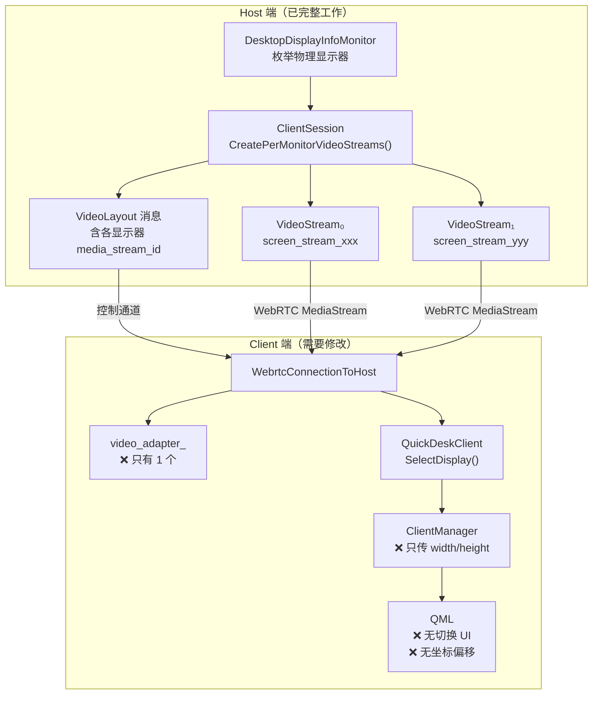
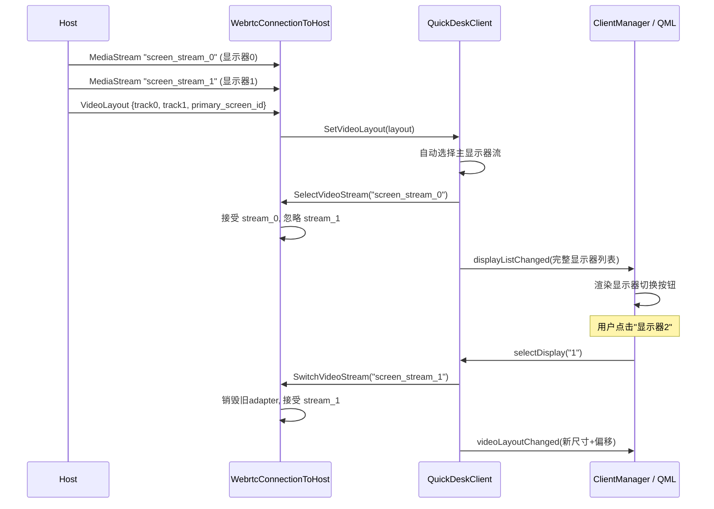
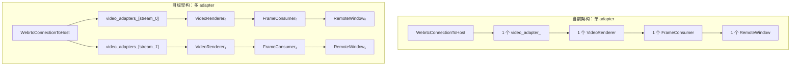

# 多显示器支持技术方案

## 1. 需求描述

被控端（Host）有多个物理显示器时，控制端（Client）需要能够：

1. **阶段一（单显示器切换）**：查看被控端的显示器列表，通过 UI 在不同显示器之间切换查看和操作
2. **阶段二（全桌面拼接）**：将被控端所有显示器画面拼接为一个完整画面查看
3. **阶段三（多窗口独立显示）**：为被控端每个显示器各打开一个本地窗口，同时查看和操作

---

## 2. 现状分析

### 2.1 Host 端：多流已强制开启

在非 ChromeOS 平台（QuickDesk 运行的 Windows/Mac/Linux），Host 端 **强制使用 multi-stream 模式**，为每个物理显示器创建独立的 WebRTC 视频流：

```
src/remoting/host/client_session.cc (第 678-680 行):

#else
  // On non-ChromeOS platforms, create the per-monitor streams immediately,
  // avoiding any transition from single-stream to multi-stream.
  CreatePerMonitorVideoStreams();
#endif
```

`CreatePerMonitorVideoStreams()` 遍历 `desktop_display_info_` 中的每个显示器，为每个创建一个 WebRTC video stream：

```
src/remoting/host/client_session.cc (第 695-710 行):

  for (int i = 0; i < desktop_display_info_.NumDisplays(); i++) {
    auto id = desktop_display_info_.GetDisplayInfo(i)->id;
    auto video_stream = connection_->StartVideoStream(
        id, desktop_environment_->CreateVideoCapturer(id));
    video_streams_[id] = std::move(video_stream);
  }
```

同时，`OnDesktopDisplayChanged()` 会构建完整的 `VideoLayout` 消息发送给 Client，每个显示器的 `VideoTrackLayout` 包含 `media_stream_id`：

```
src/remoting/host/client_session.cc (第 1341-1344 行):

    if (multiStreamEnabled) {
      video_track->set_media_stream_id(
          protocol::WebrtcVideoStream::StreamNameForId(display.screen_id()));
    }
```

**结论：Host 端的多显示器枚举、多流创建、VideoLayout 下发已经完整工作。**

### 2.2 Client 端：存在 8 个关键问题

#### 问题 ①：`SelectVideoStream` 只是本地过滤，无法动态切换已建立的流

```
src/remoting/protocol/webrtc_connection_to_host.cc (第 297-300 行):

void WebrtcConnectionToHost::SelectVideoStream(const std::string& stream_id) {
  selected_video_stream_id_ = stream_id;
  // 只设置了一个 string 变量，没有任何网络操作
}
```

该方法仅设置过滤变量。当 Host 发来新 MediaStream 时，`OnWebrtcTransportMediaStreamAdded` 检查此变量决定接受或忽略。**但在 multi-stream 模式下，Host 在连接建立时就把所有流都推过来了。如果 Client 在此之后调用 `SelectVideoStream`，之前已接受的流不会被替换。**

`QuickDeskClient::SelectDisplay()` 中的注释已确认此问题：

```
src/remoting/quickdesk/client/common/quickdesk_client.h (第 264 行):

  // 暂不支持动态切换，只能在流到来之前设置给WebrtcConnectionToHost
```

#### 问题 ②：Client 端只有单个 `video_adapter_`

```
src/remoting/protocol/webrtc_connection_to_host.h (第 123 行):

  std::unique_ptr<WebrtcVideoRendererAdapter> video_adapter_;
```

收到新流时，如果 label 不同会销毁旧的并打印 warning：

```
src/remoting/protocol/webrtc_connection_to_host.cc (第 270-272 行):

    LOG(WARNING) << "Received multiple media streams. Ignoring all except "
                    "the last one.";
```

#### 问题 ③：Client 未声明 `multiStream` capability

```
src/remoting/quickdesk/client/common/quickdesk_client.cc (第 1161-1169 行):

  std::string client_caps;
  client_caps += protocol::kSendAttentionSequenceAction;
  client_caps += " ";
  client_caps += protocol::kLockWorkstationAction;
  client_caps += " ";
  client_caps += protocol::kFileTransferCapability;
  client_caps += " ";
  client_caps += protocol::kPrivacyScreenCapability;
  // 缺少 kMultiStreamCapability
```

#### 问题 ④：`SelectDesktopDisplay` 在非 ChromeOS 平台被忽略

```
src/remoting/host/client_session.cc (第 501-503 行):

#else
  LOG(WARNING) << "Ignoring deprecated SelectDesktopDisplayRequest.";
#endif
```

#### 问题 ⑤：`SetResolution` 缺少 `screen_id`

```
src/remoting/quickdesk/client/common/quickdesk_client.cc (第 1492-1497 行):

  protocol::ClientResolution resolution;
  resolution.set_width_pixels(width);
  resolution.set_height_pixels(height);
  resolution.set_x_dpi(dpi);
  resolution.set_y_dpi(dpi);
  // 缺少 resolution.set_screen_id(...)
```

Proto 定义要求：当 Host 有多个显示器时，不带 `screen_id` 的 `ClientResolution` 消息会被忽略。

#### 问题 ⑥：鼠标坐标映射缺少显示器偏移

```
QuickDesk/QuickDesk/qml/quickdeskcomponent/RemoteDesktopView.qml (第 87-89 行):

  var remoteX = Math.round(relativeX * targetWidth / rect.width);
  var remoteY = Math.round(relativeY * targetHeight / rect.height);
  return { x: remoteX, y: remoteY };
```

只用了单个显示器的 width/height，没有加上显示器在全局桌面中的 `position_x/position_y` 偏移。

#### 问题 ⑦：`OnVideoLayoutChanged` 信息不完整

```
src/remoting/quickdesk/client/common/quickdesk_client.h (第 131-132 行):

  virtual void OnVideoLayoutChanged(int width_dips, int height_dips) {}
```

只传了当前活动显示器的宽高，没有传递完整的显示器列表（各显示器的 index、screen_id、name、size、position、是否 primary）。

Qt 层同样只转发了简单的宽高：

```
QuickDesk/QuickDesk/src/manager/ClientManager.h (第 192-193 行):

  void videoLayoutChanged(const QString& deviceId,
                          int widthDips, int heightDips);
```

#### 问题 ⑧：`SetActiveDisplay` 未实现

```
src/remoting/quickdesk/client/common/quickdesk_client.cc (第 1295-1297 行):

void QuickDeskClient::SetActiveDisplay(
    const protocol::ActiveDisplay& active_display) {
  NOTIMPLEMENTED();
}
```

### 2.3 数据流总览



---

## 3. 阶段一：单显示器切换

**目标**：用户可以在工具栏上看到被控端的显示器列表，点击切换查看不同显示器。

### 3.1 技术方案

核心思路：**Host 强制推送所有显示器的流，Client 在 WebRTC 层面只接受其中一个流。切换显示器时，销毁当前 adapter，接受另一个流的 adapter。**



### 3.2 修改清单

#### 3.2.1 WebrtcConnectionToHost：支持动态切换流

**修改文件**：`src/remoting/protocol/webrtc_connection_to_host.h/cc`

当前 `SelectVideoStream` 只设置了一个字符串变量。需要改为真正的流切换：

```cpp
// webrtc_connection_to_host.h 新增
private:
  // 保存所有收到但未被接受的流，供后续切换使用
  std::map<std::string, webrtc::scoped_refptr<webrtc::MediaStreamInterface>>
      pending_streams_;

public:
  // 替代原有的 SelectVideoStream，支持运行时切换
  void SwitchVideoStream(const std::string& stream_id);
```

```cpp
// webrtc_connection_to_host.cc

void WebrtcConnectionToHost::OnWebrtcTransportMediaStreamAdded(
    scoped_refptr<webrtc::MediaStreamInterface> stream) {
  if (stream->GetVideoTracks().size() > 0) {
    std::string stream_id = stream->id();

    if (!selected_video_stream_id_.empty() &&
        stream_id != selected_video_stream_id_) {
      // 不接受，但保存引用供后续切换
      LOG(INFO) << "Storing pending video stream: " << stream_id;
      pending_streams_[stream_id] = stream;
      return;
    }

    LOG(INFO) << "Accepting video stream: " << stream_id;
    pending_streams_.erase(stream_id);  // 从 pending 中移除
    GetOrCreateVideoAdapter(stream_id)->SetMediaStream(stream);
    // ... 后续 video_stats 处理不变
  }
  // ... audio 处理不变
}

void WebrtcConnectionToHost::SwitchVideoStream(const std::string& stream_id) {
  LOG(INFO) << "Switching video stream to: " << stream_id;
  selected_video_stream_id_ = stream_id;

  // 将当前活跃流移回 pending
  if (video_adapter_) {
    std::string old_id = video_adapter_->label();
    if (auto it = pending_streams_.find(old_id); it == pending_streams_.end()) {
      // adapter 持有的 media_stream_ 需要保存回 pending
      pending_streams_[old_id] = video_adapter_->media_stream();
    }
    video_adapter_.reset();
  }

  // 从 pending 中取出目标流并激活
  auto it = pending_streams_.find(stream_id);
  if (it != pending_streams_.end()) {
    GetOrCreateVideoAdapter(stream_id)->SetMediaStream(it->second);
    pending_streams_.erase(it);
  }
}
```

同时需要在 `WebrtcVideoRendererAdapter` 中暴露其持有的 `media_stream_` 引用。

**注意**：`WebrtcVideoRendererAdapter` 析构时会正确调用 `RemoveSink`，确保旧流不会继续往已销毁的 sink 推帧。

#### 3.2.2 QuickDeskClient：声明 multiStream capability + 传递完整显示器列表

**修改文件**：`src/remoting/quickdesk/client/common/quickdesk_client.h/cc`

**a) 声明 capability：**

```cpp
// quickdesk_client.cc SetCapabilities() 中添加
  client_caps += " ";
  client_caps += protocol::kMultiStreamCapability;
```

**b) 扩展 Observer 接口：**

```cpp
// quickdesk_client.h Observer 中替换 OnVideoLayoutChanged
struct DisplayInfo {
  int index;
  int64_t screen_id;
  std::string media_stream_id;
  int width;
  int height;
  int position_x;
  int position_y;
  int x_dpi;
  int y_dpi;
  std::string display_name;
  bool is_primary;
};

virtual void OnDisplayListChanged(
    const std::vector<DisplayInfo>& displays,
    int active_display_index) {}
```

**c) 改造 SetVideoLayout()：**

从 `VideoLayout` 中提取完整显示器信息，构建 `DisplayInfo` 向量传给 Observer。

**d) 改造 SelectDisplay() 使用 SwitchVideoStream：**

```cpp
void QuickDeskClient::SelectDisplay(const std::string& display_id) {
  // ... 现有校验逻辑 ...
  selected_display_id_ = display_id;

  const auto& track = current_video_layout_.video_track(requested_index);
  if (track.has_media_stream_id()) {
    // 使用新的动态切换接口
    connection_->SwitchVideoStream(track.media_stream_id());
  }
}
```

#### 3.2.3 ConnectionManager：转发完整显示器列表

**修改文件**：`src/remoting/quickdesk/client/common/connection_manager.h/cc`

```cpp
// connection_manager.h Observer 中添加
virtual void OnDisplayListChanged(
    const std::string& connection_id,
    const base::Value::List& displays,
    int active_display_index) {}
```

在 `HostConnection` 中将 `DisplayInfo` 向量转为 `base::Value::List` 后 Post 到 UI 线程。

#### 3.2.4 NativeMessaging Client：添加 selectDisplay 命令 + displayListChanged 上行消息

**修改文件**：`src/remoting/quickdesk/client/common/quickdesk_native_messaging_client.cc`

添加 `ProcessSelectDisplay` 处理 `{type: "selectDisplay", connectionId, displayId}` 消息。

同时添加 `displayListChanged` 上行消息：

```json
{
  "type": "displayListChanged",
  "connectionId": "xxx",
  "displays": [
    {
      "index": 0,
      "screenId": 65537,
      "mediaStreamId": "screen_stream_65537",
      "width": 1920, "height": 1080,
      "positionX": 0, "positionY": 0,
      "dpi": 96,
      "displayName": "DELL U2722D",
      "isPrimary": true
    },
    {
      "index": 1,
      "screenId": 65538,
      "mediaStreamId": "screen_stream_65538",
      "width": 2560, "height": 1440,
      "positionX": 1920, "positionY": 0,
      "dpi": 109,
      "displayName": "LG 27UK850",
      "isPrimary": false
    }
  ],
  "activeDisplayIndex": 0
}
```

#### 3.2.5 Qt ClientManager：传递显示器列表 + selectDisplay 方法

**修改文件**：`QuickDesk/QuickDesk/src/manager/ClientManager.h/cpp`

```cpp
// ClientManager.h 新增
signals:
    void displayListChanged(const QString& deviceId,
                            const QJsonArray& displays,
                            int activeDisplayIndex);

public:
    Q_INVOKABLE void selectDisplay(const QString& deviceId,
                                   int displayIndex);
```

#### 3.2.6 QML：显示器切换按钮 + 坐标偏移

**修改文件**：`QuickDesk/QuickDesk/qml/views/RemoteWindow.qml`

在工具栏中添加显示器切换按钮组：

```qml
Row {
    id: monitorButtons
    visible: displayList.length > 1
    spacing: 4

    Repeater {
        model: displayList
        delegate: ToolButton {
            width: 32; height: 32
            text: (index + 1).toString()
            highlighted: index === activeDisplayIndex
            onClicked: connectionViewModel.selectDisplay(deviceId, index)

            ToolTip.text: modelData.displayName ||
                          (modelData.width + "×" + modelData.height)
            ToolTip.visible: hovered
        }
    }
}
```

**修改文件**：`QuickDesk/QuickDesk/qml/quickdeskcomponent/RemoteDesktopView.qml`

添加显示器偏移属性，修改坐标映射：

```qml
property int remoteOffsetX: 0  // 当前显示器的 position_x
property int remoteOffsetY: 0  // 当前显示器的 position_y

function mapToRemote(localX, localY) {
    // ... 现有缩放逻辑 ...
    // 加上显示器偏移
    remoteX += remoteOffsetX;
    remoteY += remoteOffsetY;
    return { x: remoteX, y: remoteY };
}
```

#### 3.2.7 SetResolution 补充 screen_id

**修改文件**：`src/remoting/quickdesk/client/common/quickdesk_client.cc`

```cpp
void QuickDeskClient::SetResolution(int width, int height, int dpi) {
  // ... 现有校验 ...
  protocol::ClientResolution resolution;
  resolution.set_width_pixels(width);
  resolution.set_height_pixels(height);
  resolution.set_x_dpi(dpi);
  resolution.set_y_dpi(dpi);

  // 指定目标显示器
  if (!selected_display_id_.empty()) {
    int idx;
    if (base::StringToInt(selected_display_id_, &idx) &&
        idx >= 0 && idx < current_video_layout_.video_track_size()) {
      resolution.set_screen_id(
          current_video_layout_.video_track(idx).screen_id());
    }
  }

  connection_->host_stub()->NotifyClientResolution(resolution);
}
```

### 3.3 文件改动总结

| 层 | 文件 | 改动内容 |
|----|------|---------|
| WebRTC Transport | `webrtc_connection_to_host.h/cc` | `pending_streams_` map + `SwitchVideoStream()` |
| WebRTC Adapter | `webrtc_video_renderer_adapter.h` | 暴露 `media_stream()` 访问器 |
| Native Client | `quickdesk_client.h/cc` | `DisplayInfo` + `OnDisplayListChanged` + `kMultiStreamCapability` + `SetResolution` 加 screen_id |
| Bridge | `connection_manager.h/cc` | 转发完整显示器列表 |
| NativeMessaging | `quickdesk_native_messaging_client.cc` | `selectDisplay` 命令 + `displayListChanged` 上行消息 |
| Qt Manager | `ClientManager.h/cpp` | `displayListChanged` 信号 + `selectDisplay()` 方法 |
| QML | `RemoteWindow.qml` | 显示器切换按钮 |
| QML | `RemoteDesktopView.qml` | 坐标偏移 `remoteOffsetX/Y` |

---

## 4. 阶段二：全桌面拼接

**目标**：用户选择"全部显示器"时，看到所有显示器拼接成的完整桌面画面。

### 4.1 技术方案

利用 Host 端已有的全桌面采集能力，而非在 Client 端拼接多个流。

在 ChromeOS 上，Host 端 `SelectDesktopDisplay("all")` 会创建一个 `kFullDesktopScreenId` 的采集器，采集整个桌面。但非 ChromeOS 平台当前忽略了这个请求（问题 ④）。

**改动思路**：在非 ChromeOS 的 `ClientSession::SelectDesktopDisplay` 中响应 `"all"` 请求 —— 停止所有 per-monitor streams，创建一个 `kFullDesktopScreenId` stream。反之，选择具体显示器时，恢复 per-monitor streams。

### 4.2 修改清单

| 文件 | 改动 |
|------|------|
| `src/remoting/host/client_session.cc` | 非 ChromeOS 分支的 `SelectDesktopDisplay` 不再直接 ignore，对 `"all"` 请求创建全桌面 stream |
| `quickdesk_client.cc` `SelectDisplay()` | 当 `display_id == "all"` 时，通过控制通道发送 `SelectDesktopDisplayRequest{id:"all"}`，而非走 `SwitchVideoStream` |
| `RemoteDesktopView.qml` | 全桌面模式下坐标映射使用全桌面尺寸，偏移为 (0,0) |
| `RemoteWindow.qml` | 显示器按钮组增加一个"全部"按钮 |

### 4.3 注意事项

- 全桌面采集比单显示器采集的分辨率大得多（如双 1080p = 3840×1080），对编码器和带宽压力更大
- 需要在 QML 中提供缩放能力（ScrollView + pinch zoom），否则画面太小
- `VideoLayout` 中的 `supports_full_desktop_capture` 字段用于判断 Host 是否支持全桌面采集

---

## 5. 阶段三：多窗口独立显示

**目标**：被控端有 N 个显示器时，控制端可以打开 N 个独立窗口，每个窗口显示一个远端显示器。

### 5.1 架构变化



### 5.2 修改清单

#### 5.2.1 WebRTC Transport 层

| 文件 | 改动 |
|------|------|
| `webrtc_connection_to_host.h` | `video_adapter_` 改为 `map<string, unique_ptr<WebrtcVideoRendererAdapter>> video_adapters_` |
| `webrtc_connection_to_host.h` | `video_renderer_` 改为 `VideoRendererFactory*` —— 按 stream_id 创建独立的 `VideoRenderer` |
| `webrtc_connection_to_host.cc` | `OnWebrtcTransportMediaStreamAdded` 为每个流创建独立的 adapter |
| `webrtc_video_renderer_adapter.h` | 暴露 `media_stream_` 引用（供流切换使用） |

#### 5.2.2 QuickDeskClient 层

| 文件 | 改动 |
|------|------|
| `quickdesk_client.h` | 构造函数从接收单个 `FrameConsumer*` 改为接收 `FrameConsumerFactory` callback |
| `quickdesk_client.cc` | 创建 `VideoRenderer` 时使用 factory，按 stream_id 分配不同的 `FrameConsumer` |
| `connection_manager.cc` | `HostConnection` 管理多个 `SharedMemoryFrameConsumer`，按 stream_id 索引 |

#### 5.2.3 Qt/QML 层

| 文件 | 改动 |
|------|------|
| `ClientManager.h/cpp` | `OnVideoFrameReady` 回调增加 `streamId` 参数，路由到对应的 `FrameProvider` |
| `ConnectionViewModel` | 管理多个 `FrameProvider` 实例 |
| `RemoteWindow.qml` | 支持从"标签页"模式切换到"多窗口"模式 |
| `MainController` | 新增多窗口生命周期管理逻辑 |

#### 5.2.4 输入路由

每个窗口对应一个显示器，鼠标事件需要加上该显示器的 `position_x/position_y` 偏移。或者在 `MouseEvent` proto 中设置 `screen_id`（Host 端 `FractionalInputFilter` 已支持按 `screen_id` 路由输入）。

#### 5.2.5 共享资源

以下资源在多窗口之间共享，不需要复制：
- WebRTC 连接 / 信令通道（1 个 `QuickDeskClient` 实例）
- 剪贴板同步
- 音频流（全局 1 份）
- 控制通道（actions、file transfer）

---

## 6. 阶段对比与优先级

| 维度 | 阶段一：单显示器切换 | 阶段二：全桌面拼接 | 阶段三：多窗口 |
|------|---------------------|-------------------|---------------|
| 用户价值 | 高 —— 解决"看不到第二个屏幕"的核心痛点 | 中 —— 概览全局 | 高 —— 多屏操作效率 |
| 改动范围 | WebRTC transport + Client + Qt/QML | + Host client_session | + 整条渲染管线 |
| 改动量 | ~500 行 | + ~200 行 | + ~1500 行 |
| 风险 | 低 —— 不改变 Host 行为 | 中 —— 需要改 Host 端逻辑 | 高 —— 多流并行渲染 |
| 前置依赖 | 无 | 阶段一 | 阶段一 |

**建议执行顺序**：阶段一 → 阶段二 → 阶段三，严格按序推进。
